# EasyPublish

基于Electron和Vue的自动化发布项目，支持向萌番组、动漫花园、末日动漫、Nyaa、Acgrip提交发布内容。

本项目旨在统一各站发布配置，简化发布流程，以及应对网站可用性差的问题，设计尽可能兼顾易用性和灵活性。

本项目部分功能仍处于测试阶段，可能尚不稳定。

------

## 使用说明

### 登录管理

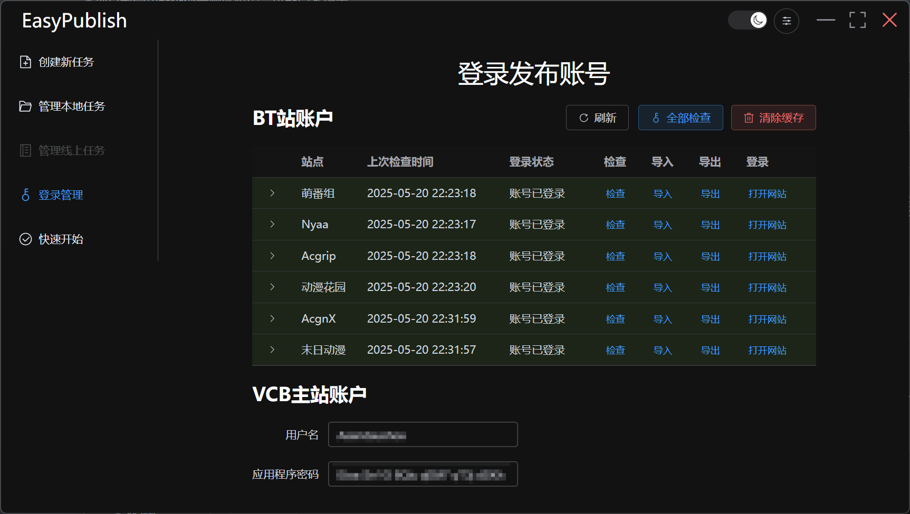

*新的登录机制仍处于测试阶段，可能尚不稳定。若遇到BUG可点击打开网站手动登录。*

在此输入各站的用户名和密码，用以登录各站。或者点击打开网站手动登录，EasyPublish会在登录窗口关闭时记录登录状态。

点击检查按钮会先检查该站的登录状态，若未登录则尝试使用输入的用户名和密码自动登录。其中，Nyaa、AcgnX、动漫花园需要手动进行人机验证。

禁用账户后检查和发布将被跳过。

遇访问失败请检查网络环境并确保能够正常访问网站。遇到AcgnX的防火墙阻止时，EasyPublish会自动弹出网站，在通过其人机验证后关闭即可。

导入导出按钮会以json的形式导入和导出EasyPublish保存的Cookie。

清除缓存按钮将清除登录窗口的所有缓存并清除EasyPublish保存的Cookie。

页面会自动刷新（如果没出BUG的话），所以刷新按钮意义不大。

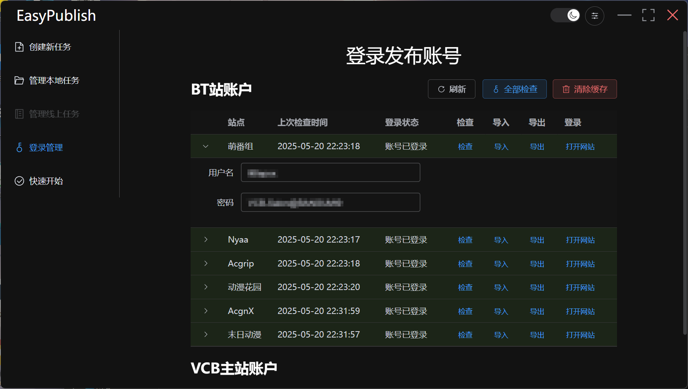

*（可选功能）* VCB主站账户用于发布主站帖，基于WP RUST API实现，应用程序密码前往仪表盘-个人资料-应用程序密码新建。

**EasyPublish明码存储您的信息，请确保运行环境安全**

### 代理设置


代理设置位于右上角，修改后将自动重启应用以使设置生效。

EasyPublish不会自动使用系统代理，若非VPN/TUN等请先配置代理设置。

### 新建项目


填写项目名称和存放配置的地址，该名称不作为发布时的标题。*（本地保存路径和项目名称已不再是必填项）* 

任务类型分为从文件创建、从模版创建和快速发布。

从文件创建需要提供发布稿和标题等必要信息，但发布流程仍然完整。

快速发布只保留发布流程的必要环节，与从文件创建基本相同，但环节更少，适用于非VCB标准的发布。

从模版创建需要提供项目的各种信息，并由EasyPublish生成发布稿，格式上符合VCB发布标准。

### 管理本地项目

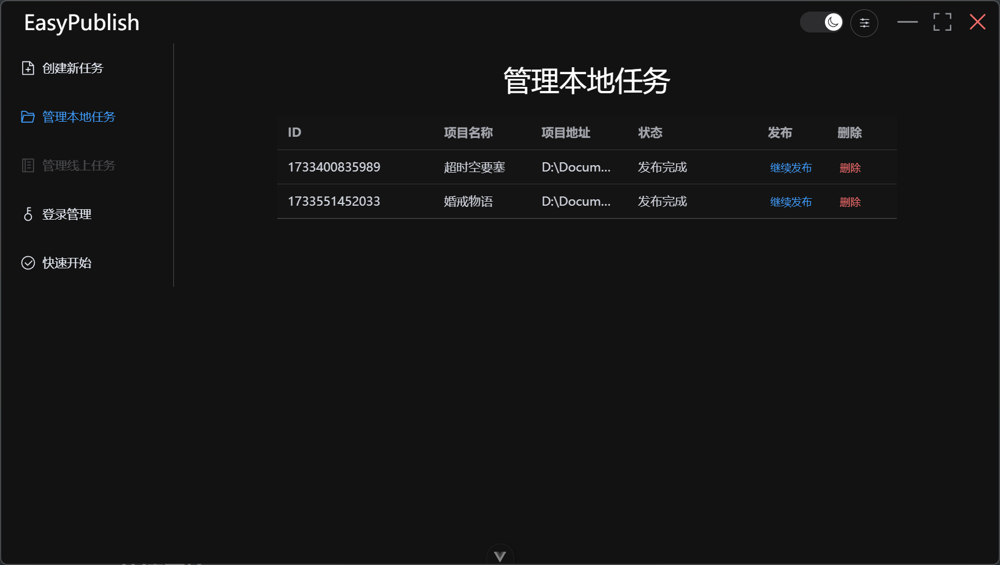

管理EasyPublish创建的项目，默认只显示未完成项目，可以从该页面继续发布流程，删除项目的同时会删除项目目录。

展开行可以查看项目地址和已发布的BT链接，右键可复制。

所有项目以创建时的时间戳作为唯一标识。

### 管理已发布项目

等下一版本（或者两个）。

------

## 快速开始

在按照上面文档配置代理、登录账户、创建项目后

### 编辑发布配置

##### 从文件创建

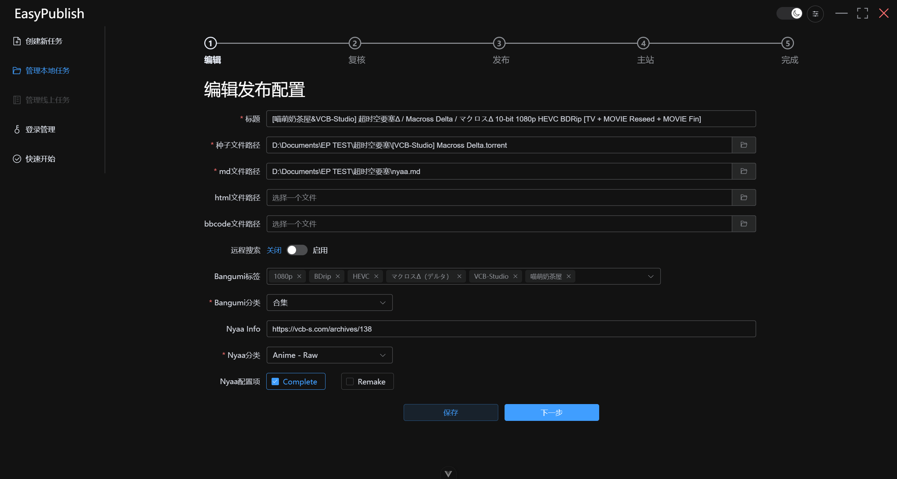

| 配置项         | 说明                                                         |
| -------------- | ------------------------------------------------------------ |
| 标题           | 用作发布帖的标题，该输入框失去焦点时将会自动提交萌番组获取标签建议 |
| 种子文件路径   | 选择要发布的种子，或者直接填写其路径                         |
| md文件路径     | *（可选）* 选择markdown格式的发布搞，或者直接填写其路径，该文件将用于Nyaa的发布 |
| html文件路径   | 选择html格式的发布稿，或直接填写其路径，该文件将用于萌番组、动漫花园、末日动漫的发布 |
| bbcode文件路径 | *（可选）* 选择bbcode格式的发布搞，或者直接填写其路径，该文件将用于Acgrip的发布 |
| 远程搜索       | 默认开启，用于从萌番组搜索标签，遇萌番组不可用时可手动关闭   |
| Bangumi标签    | （可选）选择萌番组的标签，选项默认根据标题自动向萌番组获取，若有遗漏则在框内输入相关内容，EasyPublish会搜索相关标签 |
| Bangumi分类    | 选择发布内容在萌番组上的分类                                 |
| Nyaa Info      | 填写Nyaa上Information一栏对应内容，默认填写VCB默认内容，若留空请删除 |
| Nyaa分类       | 选择发布内容在Nyaa上的分类                                   |
| Nyaa配置项     | 对应Nyaa上的两个选项                                         |

其他站点将根据萌番组和Nyaa的分类选择相应分类，分类仅收录部分，若有需要请反馈。

若没有选择MARKDOWN文件和BBCODE文件，将会根据所选的HTML文件生成对应的文件。

点击保存按钮以保存以上配置，点击下一步自动保存并进入复核阶段。

##### 从模板创建

该部分内容根据 [VCB发布规范](https://github.com/vcb-s/VCB-S_Publishing/blob/master/VCBS_Publishing.md) 设计，目前尚只能处理简单的新番和RS项目，对于系列合集、携带系列合集的复杂内容请考虑使用文件发布。

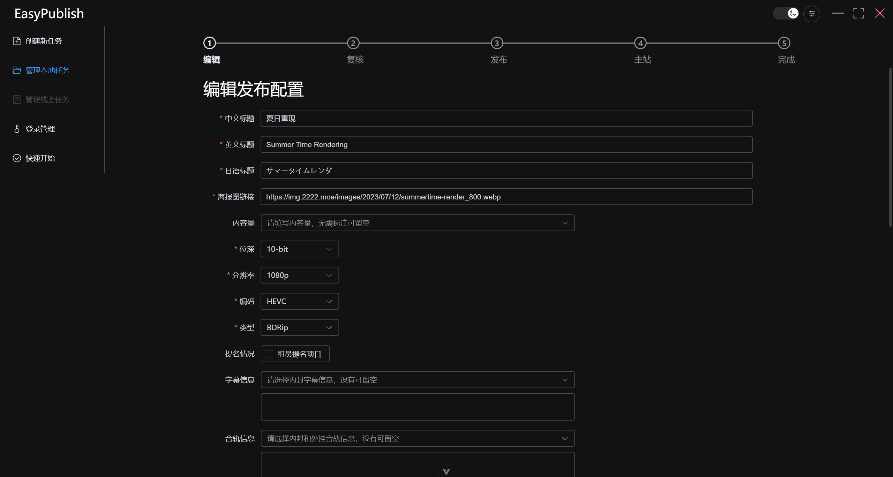

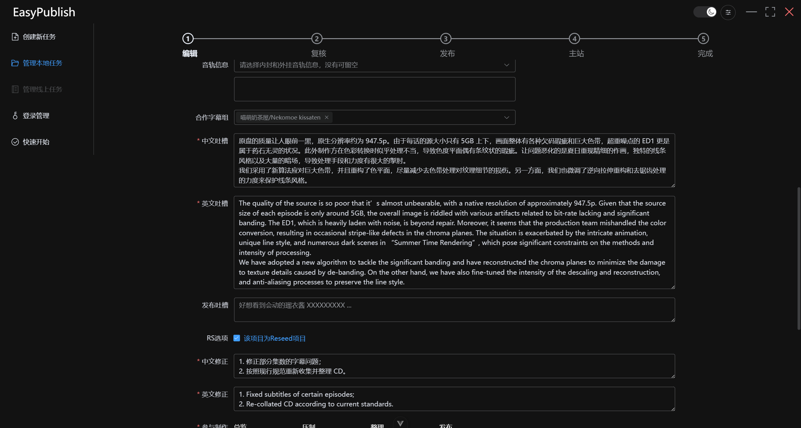

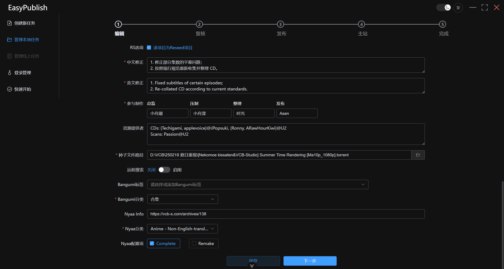


对于非RS项目：

| 配置项     | 说明                                                         |
| ---------- | ------------------------------------------------------------ |
| 中文标题   | 如实填写 |
| 英文标题   | 如实填写           |
| 日语标题   | 如实填写            |
| 海报图链接 | 如实填写                                                     |
| 内容量     | *（可选）* 指示项目包含的内容，如S1、OVA等，选项中缺少可直接输入，无需标注可留空 |
| 位深       | 如实填写，选项中缺少可添加                                   |
| 分辨率     | 如实填写，选项中缺少可添加                                   |
| 编码       | 如实填写，选项中缺少可添加                                   |
| 类型       | 如实填写，选项中缺少可添加，如BDRip、DVDRip                  |
| 提名情况   | 指示该项目是否为组员提名项目                                 |
| 字幕信息   | *（可选）* 选择内封字幕信息，缺少语言可直接输入，没有可留空；下方输入框将呈现最终效果，若不合预期可直接修改或重新填写，但应始终保持一行中文一行英文 |
| 音轨信息   | *（可选）* 选择内封和外挂音轨信息，没有可留空；下方输入框将呈现最终效果，若不合预期可直接修改或重新填写，但应始终保持一行中文一行英文 |
| 合作字幕组 | *（可选）* 选择项目的合作字幕组，若缺少请按照 `中文组名/English Name` 的格式输入添加，没有可留空 |
| 中文吐槽   | 填写总监的画质吐槽，请不要在行首和行尾留有多余的空格和换行   |
| 英文吐槽   | 填写画质吐槽的英文版本，应与中文吐槽的段落数保持严格一致，请不要在行首和行尾留有多余的空格和换行 |
| 发布吐槽   | *（可选）* 填写参与制作者留下的吐槽，每行对应一个，请不要在行首和行尾留有多余的空格和换行 |
| 参与制作   | 填写参与制作的总监、整理、压制、发布                         |
| 资源提供者 | *（可选）* 填写资源提供者，每行对应一个类别，没有可留空，请不要在行首和行尾留有多余的空格和换行 |
| 对比图     | 分别填写html、md、bbcode三种格式的对比图，注意应当包含附带的文字，可尝试从url.txt文件加载 |
| 种子文件路径 | 选择要发布的种子，或者直接填写其路径 |
| 远程搜索       | 默认开启，用于从萌番组搜索标签，遇萌番组不可用时可手动关闭   |
| Bangumi标签    | *（可选）* 选择萌番组的标签，选项默认根据标题自动向萌番组获取，若有遗漏则在框内输入相关内容，EasyPublish会搜索相关标签 |
| Bangumi分类    | 选择发布内容在萌番组上的分类                                 |
| Nyaa Info      | 填写Nyaa上Information一栏对应内容，默认填写VCB默认内容，若留空请删除 |
| Nyaa分类       | 选择发布内容在Nyaa上的分类                                   |
| Nyaa配置项     | 对应Nyaa上的两个选项                                                            |

此外，若勾选主站预填写，可以在此填写发布图、署名和MediaInfo，以加快发布当日的发布速度。注意，对于RS项目，通常不需要进行预填写。

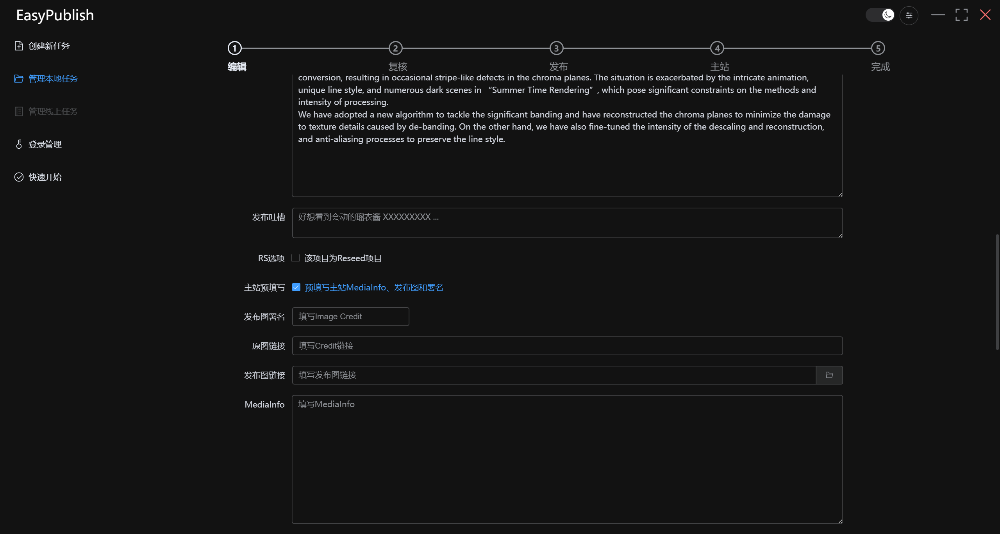

对于RS项目，无需填写对比图部分，并增加以下三个内容：

| 配置项   | 说明                                                     |
| -------- | -------------------------------------------------------- |
| 中文修正 | 填写重发修正，每行一条                                   |
| 英文修正 | 填写重发修正的英文版本，应当与中文修正的行数保持严格一致 |
| RS版本   | 填写Reseed的版本，默认为1                                |


### 复核发布内容

预览发布内容，请确保各部分准确无误。

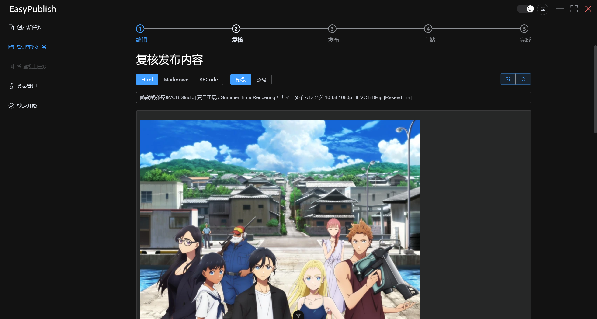

若需要修改，可以切换到源码选项进行修改，标题可在输入框修改，并点击右上保存按钮保存修改，每次保存都会保存对标题党修改。重新加载按钮将重新加载发布稿，未保存的修改将不会被记录。

导出按钮可导出发布稿以供总监审核。

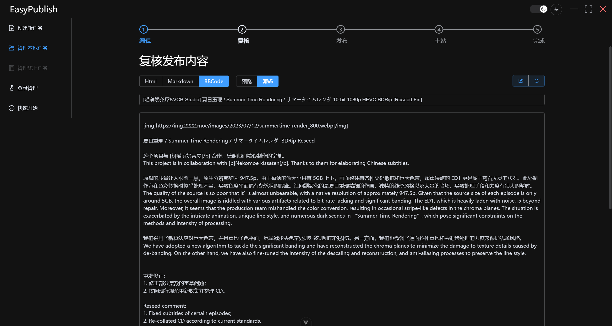

### BT发布

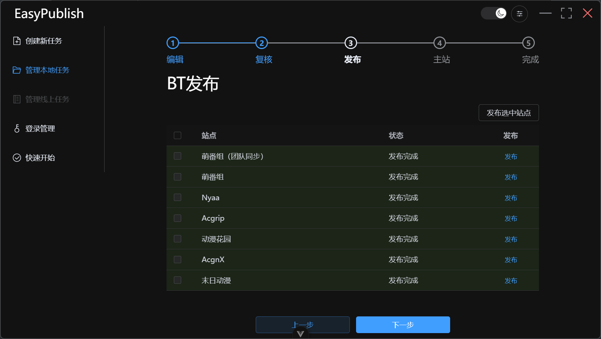

在进行发布之前，请确保账户已登录，并通过了末日动漫的防火墙验证和人机验证。

EasyPublish在发布之前会再次检查登录状态，若出现异常请前往登录管理登录账号，再转到管理本地项目继续发布。

对于末日动漫，若遇防火墙阻止将弹出登录页面，请通过人机验证后再次尝试发布。

萌番组有团队同步和非团队同步两种发布方式，任意一项发布完成均不可再次在萌番组发布。

另部分情况下可能出现疑似由网络波动造成的已发布但显示种子已存在，若出现以上情况请携日志反馈。

### 主站发布

*（该步骤可以跳过）* 

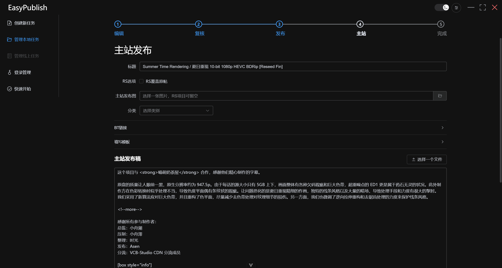

主站发布功能基于WordPress RUST API实现，需要账户登录处填写正确的用户名和应用程序密码。

发布稿支持直接填写或上传文件，若项目使用模板创建，将会自动填写标题和发布稿框架，Image Credit、MediaInfo和RS项目的旧链可以手动填入或在填写模板一栏填入。

中间折叠有前面步骤自动获取的BT站对应链接，以方便填写发布搞对应位置，右键可复制。

刷新会尝试再次获取未同步的链接（萌番组团队同步）或未获取到的链接（动漫花园），获取到后将自动填入发布稿中（仅项目为模版创建时有效）。

复制按钮可以html格式复制全部BT链接。

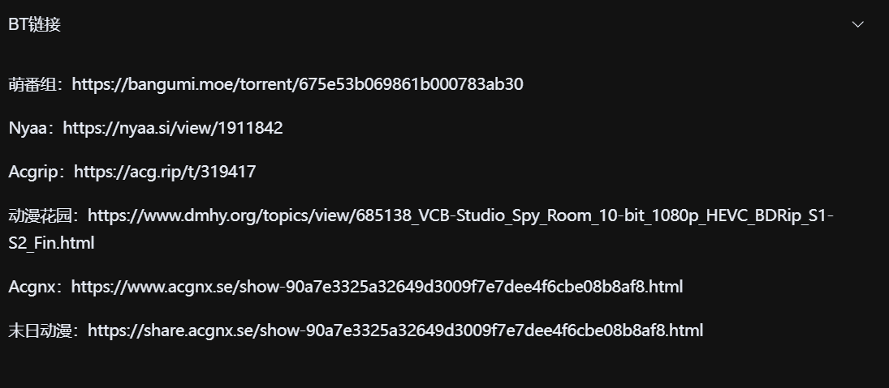

若勾选RS选项，在下方搜索框搜索并选择一个文章，EasyPublish将会在填写模板一栏自动填写原帖的Image Credit、MediaInfo、发布链接和过往修正，并自动为链接增加删除线标签，发布时将以新的内容覆盖旧的内容。

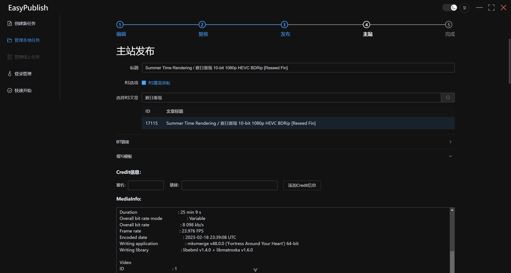

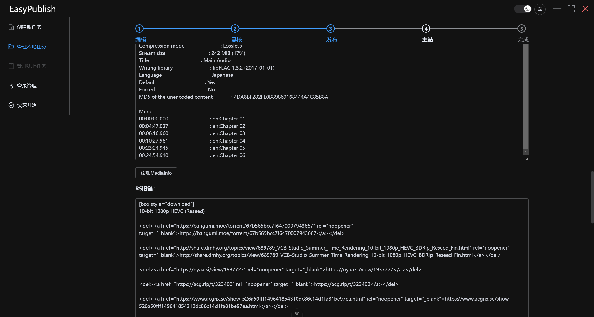

### 完成页面

若在EasyPublish发布主站帖，下方会有一个主站帖子链接。

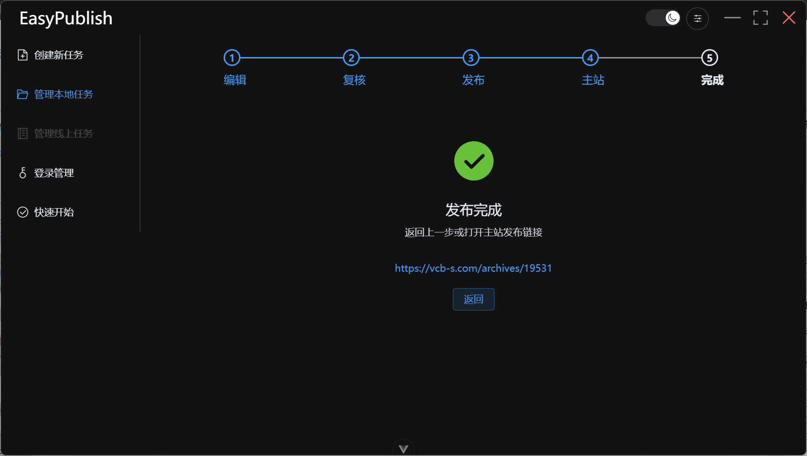

至此发布流程完成。

## 快速发布

新建任务时若选择快速发布，则发布流程将仅保留编辑发布配置（与从文件创建相同）和BT发布，适合仅需使用发布功能的用户。

------

## 开源许可

| 项目               | 开源协议           | 库                                                           |
| ------------------ | ------------------ | ------------------------------------------------------------ |
| electron           | MIT License        | [https://github.com/electron/electron](https://github.com/electron/electron) |
| vue                | MIT License        | [https://github.com/vuejs/core](https://github.com/vuejs/core) |
| vue-router         | MIT License        | [https://github.com/vuejs/router](https://github.com/vuejs/router) |
| axios              | MIT License        | [https://github.com/axios/axios](https://github.com/axios/axios) |
| axios-retry        | Apache License 2.0 | [https://github.com/softonic/axios-retry](https://github.com/softonic/axios-retry) |
| element-plus       | MIT License        | [https://github.com/element-plus/element-plus](https://github.com/element-plus/element-plus) |
| electron-log       | MIT License        | [https://github.com/megahertz/electron-log](https://github.com/megahertz/electron-log) |
| lowdb              | MIT License        | [https://github.com/typicode/lowdb](https://github.com/typicode/lowdb) |
| bbob               | MIT License        | [https://github.com/JiLiZART/bbob](https://github.com/JiLiZART/bbob) |
| marked             | MIT License        | [https://github.com/markedjs/marked](https://github.com/markedjs/marked) |
| commonmark         | BSD License        | [https://github.com/commonmark/commonmark.js](https://github.com/commonmark/commonmark.js) |
| markdown-to-bbcode | MIT License        | [https://github.com/ddormer/markdown-to-bbcode](https://github.com/ddormer/markdown-to-bbcode) |
| Turndown           | MIT License        | [https://github.com/mixmark-io/turndown](https://github.com/mixmark-io/turndown) |

------

## Project Setup

### Install

```bash
$ npm install
```

### Development

```bash
$ npm run dev
```

### Build

```bash
# For windows
$ npm run build:win

# For macOS
$ npm run build:mac

# For Linux
$ npm run build:linux
```
